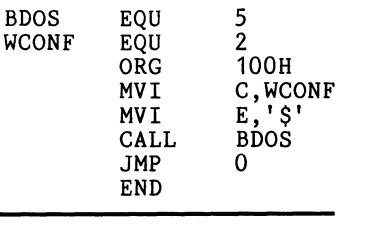

## CPM mnuals for ED, ASM, and DDt are complete 

## Using ED, there are two control keys you have to learn:
* CTRL Z
* CTRL I

### Also use CAPS LOCK for everything Assembly related

### Assembly Process:
* Using ASM to assemble source programs like TEST.ASM requires creating a .PRN (print) and .HEX (hexidecimal) file

### The assembler performs two passes through the source code:
    * The first pass builds a symbol table
    * The second resolves references and generates object code

* The output format like the Intel HEX format allows transmission of code between computers and includes error checking through CHECKSUMS!

To use ED, go make sure you are in the A> and type **ED FILENAME.TYPE**

Entering the command **I** will let you get into INSERT MODE --> You can type stuff in the Editor

## Enter CTRL + Z to get into Command Mode, Where you can use the commands like print, or beginning, etc!

Entering the command **B** will let you go back to to the beginning of the file where you edited

Enter **D** to delete one character, Typing in **3D** to delete 3 characters

Also, enter **TAB** to write in different spaces like these: 

