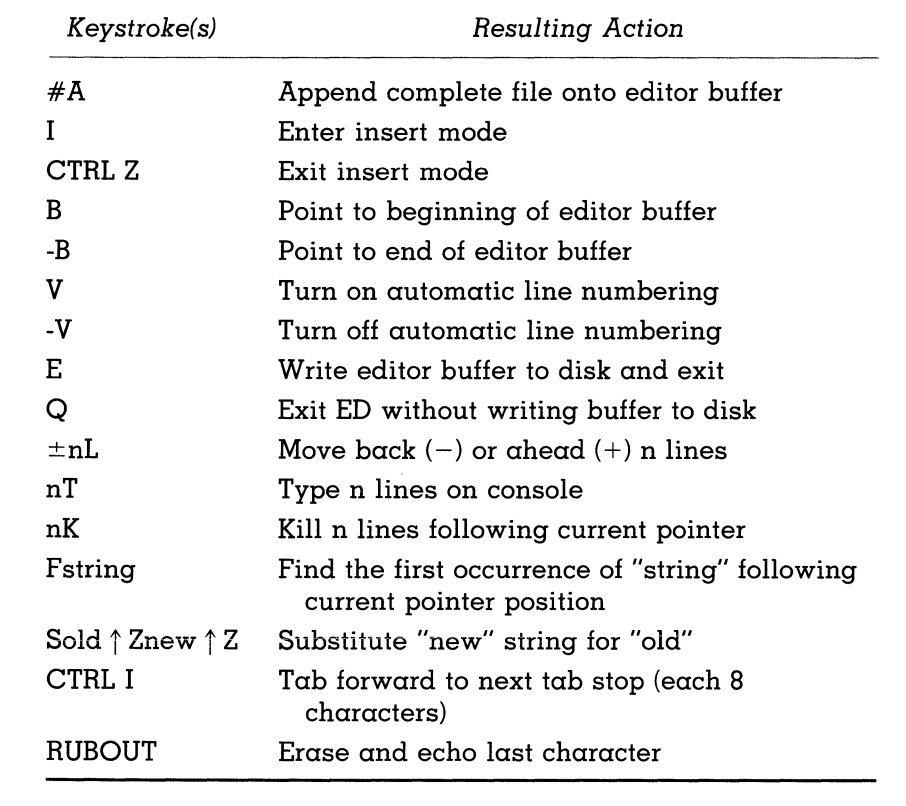

* Programming Structure: Programs should be divided into **blocks** --> Simplifies Development and Debugging!

## Subroutine Calls
* Assembly programs should consist of subroutines called by the main program - Reminds me of functions or objects?

* CPMIO Subroutines serves as a middle man between user programs and the CP/M BDOS at location 5

* Register Convetions are communications with external devices which should be handled by the CP/M BDOS!
* The BDOS utilizes the **Call Vector** to handle I/O operations

* Console Output - Outputs characters in the accumlator to the Console and Perserves othe registers

* Console Input recieves an ASCII character FROM the console --> Goes into the Accumalator --> Makes an 8th bit using *ANI 7FH* to ensure valud input data

* Register save and restore operations w/ *PUSH* or *POP*

Here is a quick key on the important Commands:

## Debugging:

* To debug, you want to assemble and load the program BUT check for the address consistency 
* You can also use the *FIND* and *JUMP* to navigate and modify your code