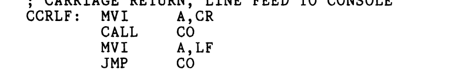
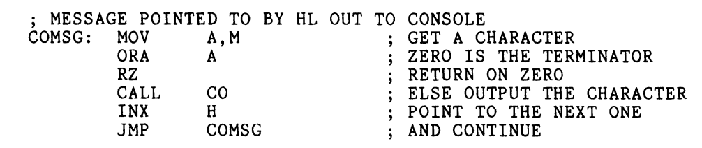
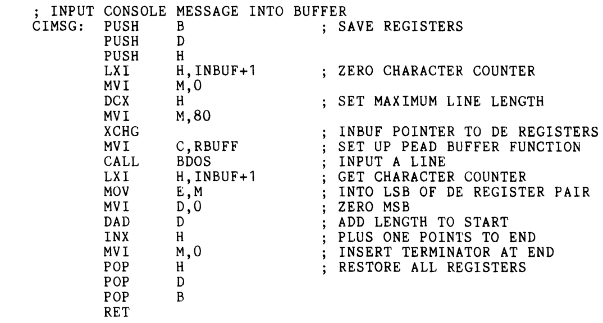

### Big Idea: In Chapter 12, we were introduced to subroutines with CI and CO --> These are REALLY impractical because it's only 1 char. at a time!

### We want to use Line-oriented I/O --> we can read the FULL LINE and display it w/ Returns

* Utilize PIP B:CPMIO.C12=CPMIO.ASM to save backup files
* Use PIP A:CPMIO.ASM=B:CPMIO.C12 for permanent backup
* Use **.LIB** files for incremental edits --> simplifies editing and testing

* Carriage Return and Line Feed (CCRLF) (Starts a new line)
    * Outputs CR and LF using the CO subroutine
    * Ends with JUMP CO --> Saves the byte and increases execution speed by directly JUMPING to CO

* Console Message Output (COMSG)
    * Use MOV A, M to get a character then check if the character is the terminator (00H) using ORA A
    * Outputs each of the characters until 00H is reached 
    * Use CALL CO to print each character and increments the pointer

* Console Input Message (CIMSG)
* Basically handles the line input w/ editing

### Debuggin using DDT
* CP/M thingy for debugging and step-by-step program inspection
* Commands
    * GADDR and ADDR - executes the program from one address to another
    * X - examines the values in registers
    * Tn - trace the n instructions and displays the values in the registers

* Before using it, remove the disks and from the drives 
* DDT relocates in the memoery and changes the address in the BDOS 
 