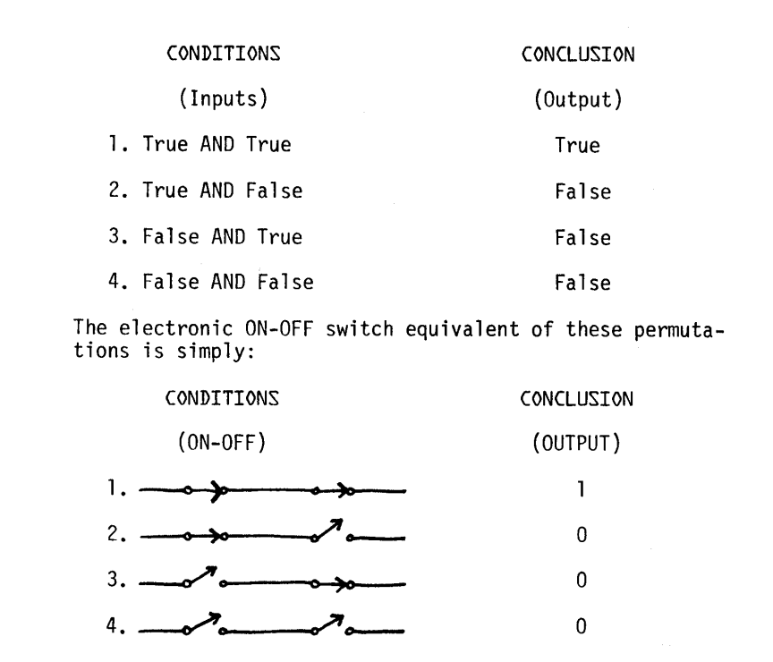
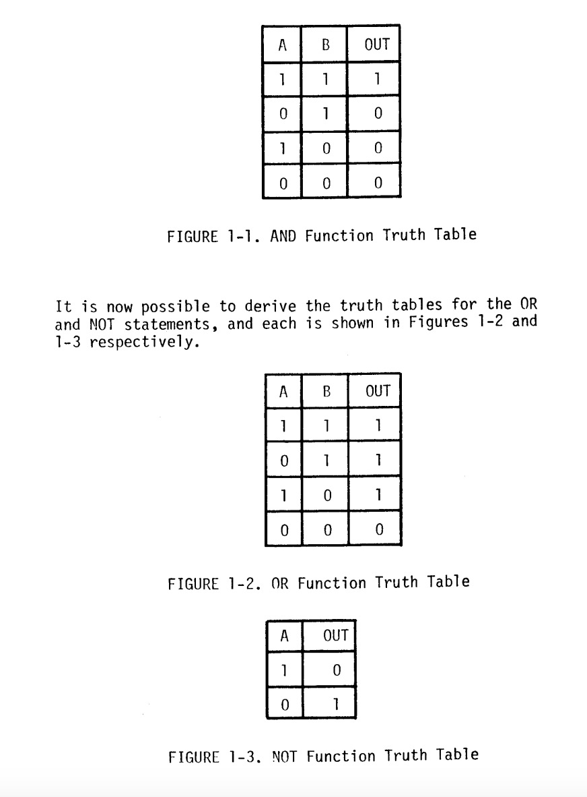
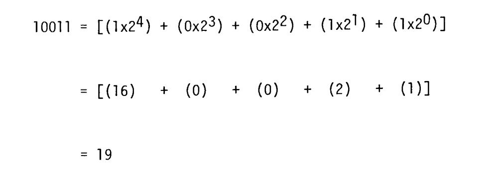

## A. Logic

* Boole had a system of logic, referred to as "Boolean Algebra" 
* Boolean Algebra assumes that logic conditions can only be represented as true or false
* ON states on a circuit are TRUE and OFF states are FALSE

* There are **3** basic logic statements:
    * AND is true if all logic conditions to be true
    * OR is true if any logic conditions are true
    * NOT reverses the Logic Statement

* You can then derive truth tables (CSC-208 throwback)

## B. Electronic Logic

* Logic functions can be represented by simple transistor circuits.

* You can also combine the basic logic functions to create more complicated logic functions like NAND and NOR

* Three or more logic circuits creates a logic system
* The Exclusive OR is a logic system, and it can be used to add two inputs (Binary Adder)
* Because logic circuits utilize 0s and 1s, they are compatible with the binary number system

## C. Number Systems
* Computers use Bits! 
    * 2 digit number system (1 and 0)
* Hex Decimal uses the Decimal system so it counts from 0 to 9 BUT it also uses the first 5 letters of the alphabet to represent 10 to 15.

## D. Binary System
* Not much explaining, it uses 0s and 1s to represent numbers and logic. 
* You can convert binary numberes to its decimal by multiplying the bit by 2 raised to the power of its position.

