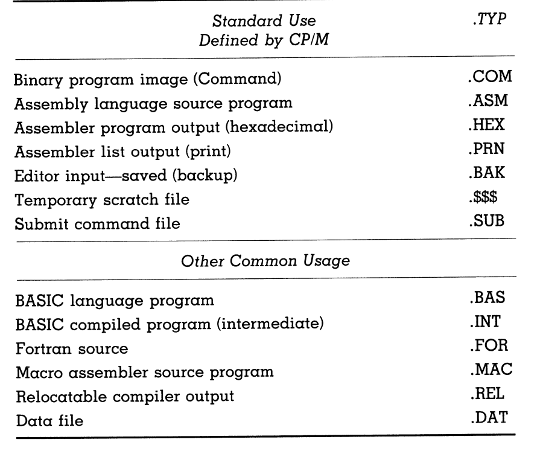

* Files contain basically any sort of information. The contents are indentified by labels (8 characters in CP/M)! 

### Default File Types:

* You can even create your own file types! (as long as they don't conflict with the defaults)

# Going over File Commands 
## DIR Command

* typing DIR in CP/M would list all the files on the current disk
* DIR *.COM will provide you with all the files of .COM (Command Files)
    * "*" basically includes any filename

* You can find files where you have the rough name known:
    * Say if you were looking for Command file where you knew the first couple of characters. You could use:

    * DIR LIFE????.COM
    * DIR LIFE*.COM

## PIP Command

* PIP B:=A:*.*
* PIP means Peripheral Interchange Program. In the line above, it copes all the files from drive A to drive B.

## Connection to Logical Devices

* Jeff and Johan talked about logical units can represent certain physical devices.

* PIP PUN:=FILENAME.TYP
* This would send the file to the physical device attached to the logical dvice PUN.

## Line Commands

* CTRL R = review before executing a command line
* CTRL U or CTRL X = Give up and try again (basically deletes everything in that line)
